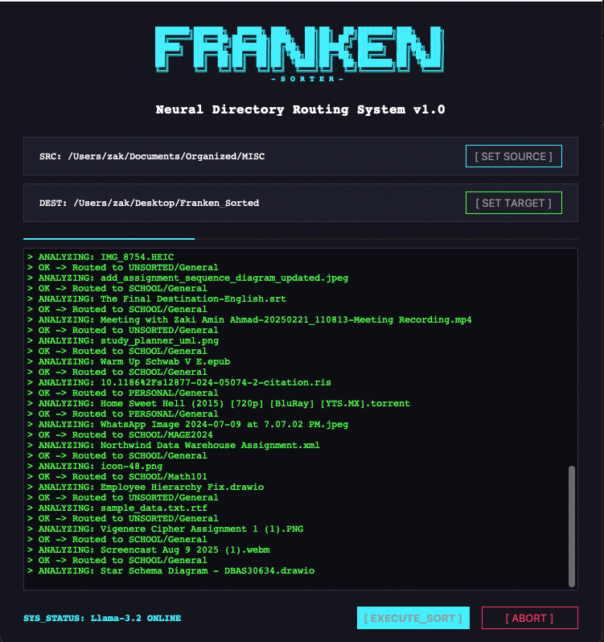

# FrankenSorter 
**Neural Directory Engine & Local AI File Router**


<div align="center">
  
</div>

FrankenSorter is a privacy-first, zero-cloud desktop application that brings order to chaotic file directories. By stitching together deterministic Regular Expressions (Regex), unstructured document parsing (ETL), and a locally hosted Large Language Model (Llama 3.2 via Ollama), this tool autonomously analyzes document content to dynamically route and rename files into structured hierarchies.

## Technical Highlights

* **100% Local Inference:** Utilizes Ollama to run Qwen2.5 7B entirely on-device, ensuring zero API rate limits, zero subscription costs, and total data privacy.
* **Hybrid Routing Heuristics:** Employs a fallback mechanism where strict deterministic Regex intercepts standard file patterns (e.g., academic course codes like `PROG23672`) before passing unstructured edge cases to the LLM.
* **Multi-Format ETL Pipeline:** Extracts metadata and text chunks from `.pdf`, `.docx`, `.pptx`, and `.xlsx` files using a suite of Python libraries. Implements defensive programming (`getattr` attribute checks) to handle malformed third-party object graphs gracefully.
* **Asynchronous GUI & Safe Halting:** Built with `customtkinter` and `threading` to decouple heavy I/O and AI inference from the main UI thread, ensuring the application remains responsive and allows for non-destructive process interruptions.
* **Schema-Enforced Structured Outputs:** Constrains the model with a JSON schema (category as an enum) and `temperature=0`, so routing is deterministic and the model physically cannot return a folder that doesn't exist — no fragile parsing of conversational fluff.

## 🛠️ Installation & Setup

**1. Install Local AI Engine (Ollama)**
* Download and install [Ollama for Mac/Windows](https://ollama.com/).
* Open your terminal and pull the LLM model:
  ```bash
  ollama pull qwen2.5:7b
  ```

**2. Clone & Install Dependencies**
```bash
git clone [https://github.com/zakiaminn/FrankenSorter.git](https://github.com/zakiaminn/FrankenSorter.git)
cd FrankenSorter
pip install -r requirements.txt
```
*(Dependencies include: `customtkinter`, `ollama`, `pdfplumber`, `python-docx`, `python-pptx`, `openpyxl`)*

**3. Run the Application**
```bash
python3 FrankenSorter.py
```

## How it Works

1. **Extraction:** FrankenSorter reads the first 1,200 characters of a document (avoiding context-window overflow).
2. **Analysis:** Text is fed to Qwen2.5 7B with a strict JSON schema requesting categorization (School, Work, Personal, Finance) and subject generation.
3. **Execution:** FrankenSorter generates directories dynamically based on the AI's output, renames the file to PascalCase, resolves any naming collisions using epoch timestamps, and executes the file move.

## Future Roadmap
* Support for nested sub-directory scanning (recursive routing).
* Implementation of an "Undo Last Sort" feature mapping via JSON history logs.
* OCR implementation (Tesseract) for analyzing image-only (`.jpg`, `.png`) documents.

---
*Created as a portfolio project showcasing modern Python architecture, UI/UX design, and practical AI application.*