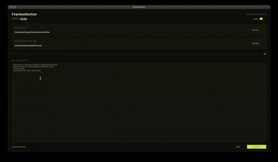

# FrankenSorter

**a local ai file sorter — reads your documents and files them away, all on your own machine**


<div align="center">
  
</div>

point it at a folder full of random documents and it reads each one, works out whether it's school, work, personal, or finance, and files it into the right folder with a clean name. nothing leaves your machine — no api key, no subscription, no upload.

it leans on regex for the obvious calls and a local language model (qwen2.5 7b through ollama) for everything it can't pattern-match.

## what makes it work

* **100% local.** the model runs on your own machine through ollama. no rate limits, no subscription, nothing gets uploaded.
* **regex first, model second.** the obvious stuff never touches the llm — a course code like `PROG23672` in the filename is school, full stop. junk prefixes like `IMG` or `SCAN` are blocklisted so a photo doesn't read as a course code. everything regex can't call falls through to the model.
* **the model can't go off-script.** it answers against a json schema where the category is an enum, so it literally can't hand back a folder that doesn't exist. temperature's pinned to 0, so the same file sorts the same way every time — no digging a real answer out of conversational fluff.
* **reads real documents.** pulls text from `.pdf`, `.docx`, `.pptx`, and `.xlsx`. handles malformed files without crashing (getattr's its way through the weird ones) and skips anything over 50mb so the app never hangs.
* **the ui never freezes.** built with customtkinter, and the sorting runs on a background thread. the stop button halts cleanly between files, so nothing's ever left half-moved.

## setup

**1. install ollama and pull the model**

grab [ollama](https://ollama.com/), then:
```bash
ollama pull qwen2.5:7b
```

**2. clone and install the deps**
```bash
git clone https://github.com/zakiaminn/FrankenSorter.git
cd FrankenSorter
pip install -r requirements.txt
```
deps: `customtkinter`, `ollama`, `pdfplumber`, `python-docx`, `python-pptx`, `openpyxl`

**3. run it**
```bash
python3 FrankenSorter.py
```

## how it works

1. **extract** — reads the first ~1200 characters of a file. enough to know what it is, small enough to not blow past the context window.
2. **analyze** — hands that text to qwen2.5 7b with the schema and gets back a category (school / work / personal / finance), a subject, and a cleaned-up name.
3. **execute** — makes the category folder if it isn't there yet, renames the file to pascalcase, breaks any name collisions with an epoch timestamp, and moves it.

## roadmap

* recursive scanning into subfolders
* an "undo last sort" — keep a small json history log and reverse it
* ocr (tesseract) so it can handle image-only files like `.jpg` and `.png`

---

*built as a portfolio project — modern python, a bit of ui/ux, and a genuinely useful local-llm workflow.*
